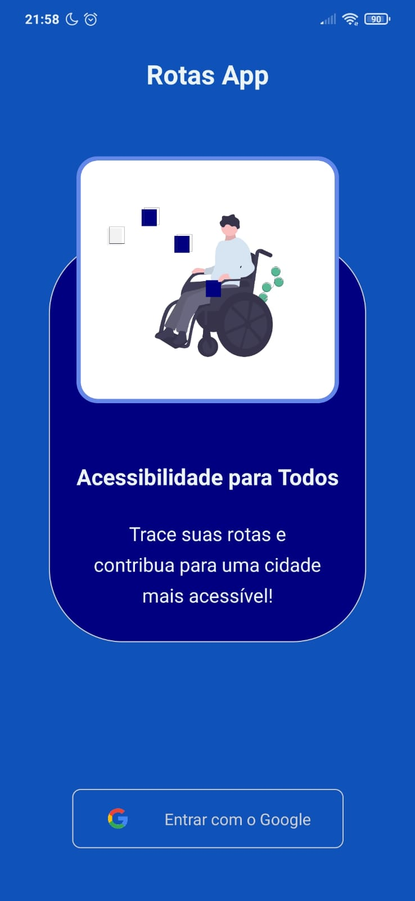

<h1 align="center">
    
</h1>

<h1 align="center">
    
</h1>

## 📝 Sobre

O projeto **Routes App** foi o aplicativo que desenvolvi como Trabalho de Conclusão de Curso, tem a ideia de que pessoas com deficiência motora ou mobilidade reduzida consigam marcar as ruas que estão inacessíveis e então o aplicativo gera no mapa uma sinalização, para que outros usuários tenham conhecimento da inacessibilidade do local e evitar o trajeto.

---

## 🚀 Tecnologias Utilizadas

- [.NET Core 5](https://learn.microsoft.com/pt-br/dotnet/core/whats-new/dotnet-5)
- [React Native](https://reactnative.dev)
- [SQL Server](https://www.microsoft.com/pt-br/sql-server/sql-server-2019?SilentAuth=1&wa=wsignin1.0)

---

## 💻 Baixar e Executar o Projeto

```bash

    # Clonar o repositório do GIT
    $ git clone https://github.com/maumauagain/RoutesApp

    # Acessar o diretório contendo o projeto
    $ cd RoutesApp

    # Acessar o diretório contendo o backend do projeto
    $ cd backend 

    # Instalar as dependências do backend do projeto
    $ dotnet restore

    # Iniciar o projeto backend
    $ dotnet run

    # Acessar o diretório contendo o mobile do projeto
    $ cd mobile 

    # Instalar as dependências do mobile do projeto
    $ npm install

    # Iniciar o projeto mobile
    $ expo start

    # Acessar o diretório contendo a function do projeto
    $ cd function 

    # Instalar as dependências do projeto da function
    $ dotnet restore

    # Iniciar o projeto function
    $ dotnet run

```

---

<h4 align="center">
    Desenvolvido por <a href="https://www.linkedin.com/in/amauri-martins-júnior-73090a169" target="_blank">Amauri Martins </a> ⚓
</h4>
